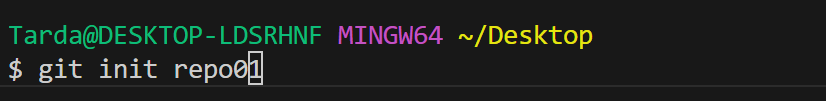
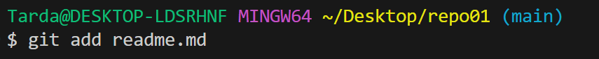
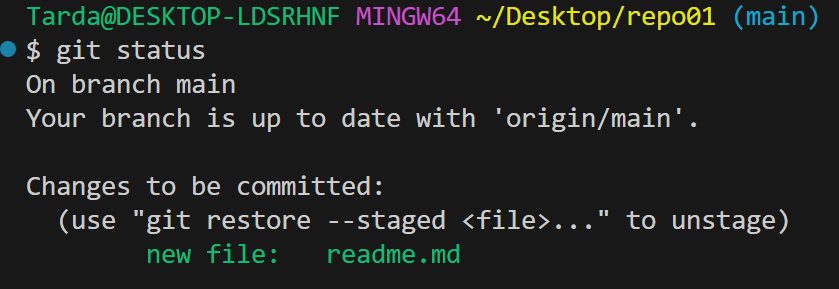
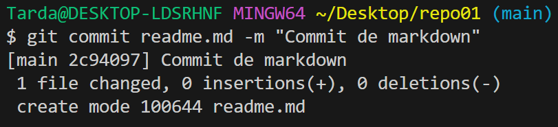

# Crear repositiorio en git

Utilizando el comando git init "nombre del repositorio", creamos una carpeta que contiene un repositorio de git en su interior.

Añado el fichero al stagin area con el comando add.

Y ahora hago un commit al repositorio local

